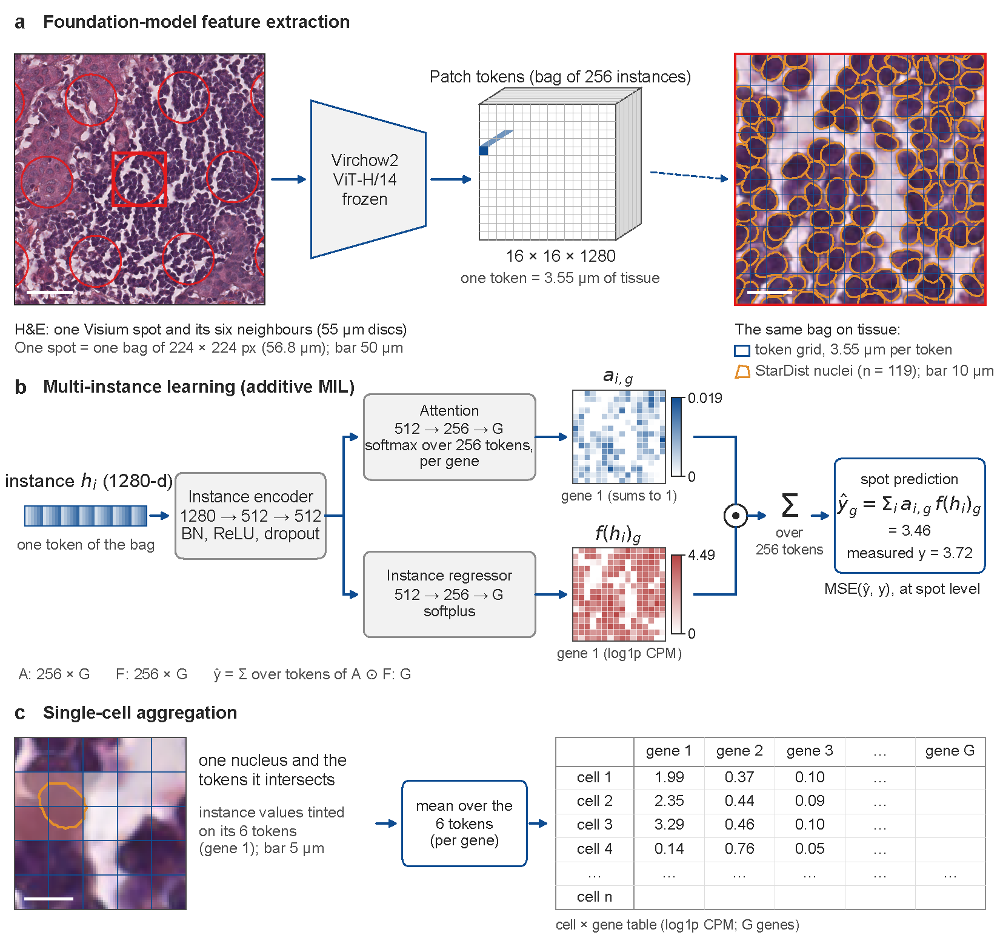
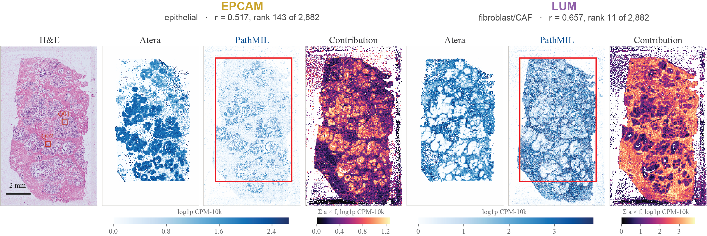
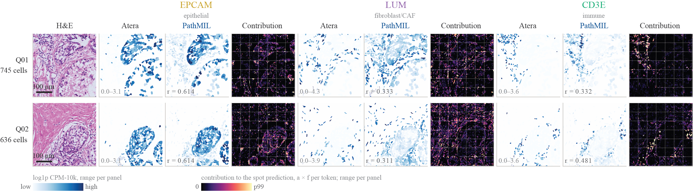

# PathMIL

PathMIL predicts gene expression and gene-module scores from H&E histology with
attention-based multiple instance learning. Each Visium spot is a bag, and the
256 Virchow2 patch tokens around it are the instances. A per-gene attention head
weights the tokens, an instance regressor scores each of them, and the spot
prediction is the weighted sum of those scores. Because the model is additive,
the same instance scores give a 16 x 16 prediction map inside every tile, which
can be averaged over segmented nuclei to produce single-cell predictions from a
plain H&E slide. Training needs only Visium data and the matching H&E image; no
clinical metadata is required.



## Results

Whole-tissue predictions for EPCAM and LUM from H&E alone, compared with Atera
measurements of the same section. The contribution maps show how much each
token adds to the spot prediction.



Single-cell predictions in the two boxed regions for EPCAM, LUM and CD3E.



## Install

```bash
mamba create -n PathMIL python=3.11 uv
mamba activate PathMIL
git clone https://github.com/GenomicsMachineLearning/PathMIL.git
cd PathMIL
uv pip install -e .[embed]
```

The `[embed]` extras are only needed for the `preprocess` step. To train, predict
and plot from existing embeddings, `pip install -e .` is enough. For H&E-only
inference use `uv pip install -e .[he]`.

Virchow2 (`paige-ai/Virchow2`) is gated on Hugging Face. Request access and run
`huggingface-cli login` before `preprocess`.

## Quickstart

Copy `configs/example.yaml`, point it at your Visium data, then run the pipeline:

```bash
pathmil preprocess    --config configs/example.yaml                       # GPU; patch embeddings
pathmil build-targets --config configs/example.yaml --target genes        # CPU; combined H5
pathmil train         --config configs/example.yaml --target genes --mode full   # GPU; full training
pathmil predict       --config configs/example.yaml --target genes        # GPU; predictions + PCC
pathmil plot          --config configs/example.yaml                       # CPU; figures
```

Use `--target modules` with `configs/example_modules.yaml` for gene-module scores.

To apply a trained checkpoint to an H&E slide without Visium data, and optionally
get per-cell predictions:

```bash
python scripts/predict_he.py \
    --slide tumour.svs \
    --checkpoint model_checkpoint.pth \
    --out results/ \
    --sc_pred
```

## License

Released under the [MIT License](LICENSE).
